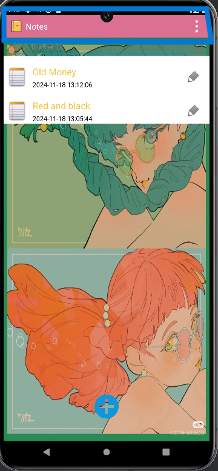

# MyNotePad
### 一. `扩展功能如下：`
1. NoteList界面中笔记条目增加时间戳显示；
2. 添加笔记查询功能（根据标题查询）；
3. UI美化；
4. 支持多类型笔记；
### 二. `笔记条目增加时间戳:`

1. NotesListAdapter.java：负责显示每个笔记的创建时间，并通过 DateUtil.StringToDate() 转换时间戳为易读格式。

```properties
// 创建 NotesListAdapter 并设置给 ListView
NotesListAdapter adapter = new NotesListAdapter(this, cursor, Notes.CONTENT_URI, "com.example.android.notepad.action.EDIT");
listView.setAdapter(adapter);
```

2. DateUtil.java：工具类，提供了时间戳转换为日期的功能。

```properties
public class DateUtil {

    /**
     * 将时间戳字符串转换为日期格式
     * @param timestamp 时间戳（字符串）
     * @return 格式化后的日期字符串
     */
    public static String StringToDate(String timestamp) {
        long time = Long.parseLong(timestamp); // 将字符串时间戳转为 long 类型
        SimpleDateFormat sdf = new SimpleDateFormat("yyyy-MM-dd HH:mm:ss"); // 设置日期格式
        Date date = new Date(time); // 使用时间戳创建日期对象
        return sdf.format(date); // 将日期格式化为字符串
    }
}
```

### 三. `添加笔记查询功能：`


1. NotesListAdapter.java 通过 Cursor 查询从数据库获取笔记数据，并在 readDate() 和 readDate(Cursor cursor) 方法中处理。

```properties
public void readDate() {
    mDate.clear();
    while(cursor.moveToNext()) {
        mDate.add(new NoteBean(cursor.getString(COLUMN_INDEX_TITLE), cursor.getString(COLUMN_INDEX_MODIFICATION_DATE), cursor.getString(COLUMN_INDEX_ID)));
        Log.d("search", cursor.getString(COLUMN_INDEX_TITLE) + "," + cursor.getString(COLUMN_INDEX_MODIFICATION_DATE) + "," + cursor.getString(COLUMN_INDEX_ID));
    }
}
```

```properties
public void readDate(Cursor cursor) {
    mDate.clear();
    while(cursor.moveToNext()) {
        mDate.add(new NoteBean(cursor.getString(COLUMN_INDEX_TITLE), cursor.getString(COLUMN_INDEX_MODIFICATION_DATE), cursor.getString(COLUMN_INDEX_ID)));
        Log.d("search", cursor.getString(COLUMN_INDEX_TITLE) + "," + cursor.getString(COLUMN_INDEX_MODIFICATION_DATE) + "," + cursor.getString(COLUMN_INDEX_ID));
    }
}
```

2. TitleEditor.java 使用 managedQuery 来查询笔记标题。

```properties
mCursor = managedQuery(
    mUri,        // The URI for the note that is to be retrieved.
    PROJECTION,  // The columns to retrieve
    null,        // No selection criteria are used, so no where columns are needed.
    null,        // No where columns are used, so no where values are needed.
    null         // No sort order is needed.
);

```

在 onResume() 方法中，mCursor 被移动到第一行数据，mText.setText() 设置了笔记的标题到 EditText 中。

```properties
@Override
protected void onResume() {
    super.onResume();

    // Verifies that the query made in onCreate() actually worked.
    if (mCursor != null) {
        mCursor.moveToFirst();
        mText.setText(mCursor.getString(COLUMN_INDEX_TITLE));
    }
}

```
   
3. NotesLiveFolder.java 通过设置 URI 创建 Live Folder，间接依赖笔记数据。
通过设置 LIVE_FOLDER_URI，将查询的 URI 用于创建 Live Folder。

```properties
liveFolderIntent.setData(NotePad.Notes.LIVE_FOLDER_URI);
```

4. NotesListAdapter.java 中的 Search 方法用于在已经查询的数据中进行搜索和过滤。

```properties
public void Search(String searchTitle) {
    searchData = new ArrayList<NoteBean>();
    for (NoteBean noteBean : mDate) {
        if (noteBean.getTitle().indexOf(searchTitle) != -1) {
            searchData.add(noteBean);
        }
    }
    mDate.clear();
    mDate.addAll(searchData);
    notifyDataSetChanged();
}
```

### 四. `UI美化:`
1. 更改背景
   

```properties
/*背景颜色选择框*/
private  void showpopSelectBgWindows(){
    LayoutInflater inflater = LayoutInflater.from(this);
    View view = inflater.inflate(R.layout.dialog_bg_select_layout, null);
    AlertDialog.Builder builder = new AlertDialog.Builder(this);
    builder.setTitle("背景");//设置标题
    builder.setView(view);
    AlertDialog dialog = builder.create();//获取dialog
    dialog.show();//显示对话框
}
```

```properties
/*背景改变的监听*/
    public void ColorSelect(View view) {
        String color;
        if (view.getId() == R.id.pink) {
            Drawable btnDrawable1 = getResources().getDrawable(R.drawable.one);
            ll_noteList.setBackgroundDrawable(btnDrawable1);
            lv_notesList.setBackgroundDrawable(btnDrawable1);
        } else if (view.getId() == R.id.Yello) {
            Drawable btnDrawable2 = getResources().getDrawable(R.drawable.two);
            ll_noteList.setBackgroundDrawable(btnDrawable2);
            lv_notesList.setBackgroundDrawable(btnDrawable2);
        } else if (view.getId() == R.id.PaleVioletRed) {
            Drawable btnDrawable3 = getResources().getDrawable(R.drawable.three);
            ll_noteList.setBackgroundDrawable(btnDrawable3);
            lv_notesList.setBackgroundDrawable(btnDrawable3);
        } else if (view.getId() == R.id.LightGrey) {
            Drawable btnDrawable4 = getResources().getDrawable(R.drawable.four);
            ll_noteList.setBackgroundDrawable(btnDrawable4);
            lv_notesList.setBackgroundDrawable(btnDrawable4);
        } else if (view.getId() == R.id.MediumPurple) {
            Drawable btnDrawable5 = getResources().getDrawable(R.drawable.five);
            ll_noteList.setBackgroundDrawable(btnDrawable5);
            lv_notesList.setBackgroundDrawable(btnDrawable5);
        } else if (view.getId() == R.id.DarkGray) {
            Drawable btnDrawable6 = getResources().getDrawable(R.drawable.six);
            ll_noteList.setBackgroundDrawable(btnDrawable6);
            lv_notesList.setBackgroundDrawable(btnDrawable6);
        } else if (view.getId() == R.id.Snow) {
            Drawable btnDrawable7 = getResources().getDrawable(R.drawable.seven);
            ll_noteList.setBackgroundDrawable(btnDrawable7);
            lv_notesList.setBackgroundDrawable(btnDrawable7);
        }
    }
```

```properties
<?xml version="1.0" encoding="utf-8"?>
<LinearLayout xmlns:android="http://schemas.android.com/apk/res/android"
    android:layout_width="match_parent"
    android:layout_height="wrap_content"
    android:orientation="vertical"
    android:weightSum="0.7">

    <ImageView
        android:layout_width="match_parent"
        android:layout_height="60dp"
        android:id="@+id/one"
        android:background="@drawable/one"
        android:layout_weight="0.1"
        android:onClick="ColorSelect"
        />
    <ImageView
        android:layout_width="match_parent"
        android:layout_height="60dp"
        android:layout_weight="0.1"
        android:id="@+id/two"
        android:background="@drawable/two"
        android:onClick="ColorSelect"
        />
    <ImageView
        android:layout_width="match_parent"
        android:layout_height="60dp"
        android:id="@+id/three"
        android:layout_weight="0.1"
        android:background="@drawable/three"
        android:onClick="ColorSelect"
        />
    <ImageView
        android:layout_width="match_parent"
        android:layout_height="60dp"
        android:layout_weight="0.1"
        android:id="@+id/four"
        android:background="@drawable/four"
        android:onClick="ColorSelect"
        />
    <ImageView
        android:layout_width="match_parent"
        android:layout_height="60dp"
        android:layout_weight="0.1"
        android:id="@+id/five"
        android:background="@drawable/five"
        android:onClick="ColorSelect"
        />
    <ImageView
        android:layout_width="match_parent"
        android:layout_height="60dp"
        android:layout_weight="0.1"
        android:id="@+id/six"
        android:background="@drawable/six"
        android:onClick="ColorSelect"
        />
    <ImageView
        android:layout_width="match_parent"
        android:layout_height="60dp"
        android:layout_weight="0.1"
        android:id="@+id/seven"
        android:background="@drawable/seven"
        android:onClick="ColorSelect"
        />

</LinearLayout>
```

2. 设置主题
   


```properties
<?xml version="1.0" encoding="utf-8"?>
<resources>

    <style name="AppTheme" parent="android:Theme.Holo.Light">
        <item name="android:actionBarStyle">@style/MyActionBar</item>
        <item name="android:actionMenuTextColor">@color/white</item>
        <item name="android:actionOverflowButtonStyle">@style/MyOverflowButtonStyle</item>
    </style>

    <style name="MyActionBar" parent="android:Widget.Holo.ActionBar">
        <item name="android:titleTextStyle">@style/MyTitleStyle</item>
        <item name="android:background">@color/PaleVioletRed</item>
    </style>

    <style name="MyTitleStyle" parent="android:TextAppearance.Holo.Widget.ActionBar.Title">
        <item name="android:textColor">@color/white</item>
    </style>

    <style name="MyOverflowButtonStyle" parent="android:Widget.ActionButton.Overflow">
        <item name="android:src">@drawable/icon_menu</item>
    </style>

    <style name="AppThemeDialog" parent="android:Theme.Holo.Dialog">

    </style>

    <style name="MyMenu" parent="android:TextAppearance.Holo.Small">
        <item name="android:textSize">16sp</item>
        <item name="android:textStyle">bold</item>
        <item name="android:textColor">@color/white</item>
    </style>
</resources>
```

注：

（1）主题设置：定义了 AppTheme，并自定义了 ActionBar 的样式、菜单文本颜色和溢出按钮样式。

（2）ActionBar 样式：通过 MyActionBar 自定义了 ActionBar 的背景颜色和标题文本样式。

（3）标题样式：MyTitleStyle 设置了 ActionBar 标题的文本颜色。

（4）溢出按钮样式：MyOverflowButtonStyle 自定义了溢出按钮的图标。

（5）对话框主题：AppThemeDialog 定义了一个基础的对话框样式。

（6）菜单文本样式：MyMenu 自定义了菜单文本的字体大小、样式和颜色。

### 五. `支持多类型笔记:`


注：由于做完之后虚拟器出现了些问题，重新下载了一个版本，结果版本太低了，图片显示不出来了。所以这里使用之前在做的过程中的图片了。

1. 文件：NoteEditor.java
pickImageFromGallery：启动相册选择图片。
onActivityResult：接收图片的 URI。
insertImageToDatabase：将图片 URI 保存到数据库。

```porperties
// 定义请求码
private static final int REQUEST_CODE_PICK_IMAGE = 1;

// 在点击按钮时触发选择图片的功能
public void pickImageFromGallery() {
    Intent intent = new Intent(Intent.ACTION_PICK);
    intent.setType("image/*"); // 指定只选择图片
    startActivityForResult(intent, REQUEST_CODE_PICK_IMAGE); // 启动选择器
}

// 接收相册返回的图片 URI
@Override
protected void onActivityResult(int requestCode, int resultCode, Intent data) {
    super.onActivityResult(requestCode, resultCode, data);
    if (requestCode == REQUEST_CODE_PICK_IMAGE && resultCode == RESULT_OK && data != null) {
        Uri selectedImageUri = data.getData(); // 获取图片的 URI
        if (selectedImageUri != null) {
            insertImageToDatabase(selectedImageUri); // 调用插入图片的方法
        }
    }
}

// 将图片插入数据库的方法
private void insertImageToDatabase(Uri imageUri) {
    ContentValues values = new ContentValues();
    values.put(NotePad.Notes.COLUMN_NAME_IMAGE, imageUri.toString()); // 假设数据库有 IMAGE 字段
    getContentResolver().update(mUri, values, null, null); // 更新到数据库中
}

```

3. 文件：NotePadProvider.java
数据库表增加 COLUMN_NAME_IMAGE 字段支持存储图片 URI。

```properties
@Override
public void onCreate(SQLiteDatabase db) {
    db.execSQL("CREATE TABLE " + NotePad.Notes.TABLE_NAME + " ("
            + NotePad.Notes._ID + " INTEGER PRIMARY KEY,"
            + NotePad.Notes.COLUMN_NAME_TITLE + " TEXT,"
            + NotePad.Notes.COLUMN_NAME_NOTE + " TEXT,"
            + NotePad.Notes.COLUMN_NAME_CREATE_DATE + " INTEGER,"
            + NotePad.Notes.COLUMN_NAME_MODIFICATION_DATE + " INTEGER,"
            + NotePad.Notes.COLUMN_NAME_IMAGE + " TEXT" // 添加图片 URI 字段
            + ");");
}
```

```properties
sNotesProjectionMap.put(NotePad.Notes.COLUMN_NAME_IMAGE, NotePad.Notes.COLUMN_NAME_IMAGE);
```

4. 文件：NotesListAdapter.java
在 getView 方法中加载图片 URI 并显示。

```properties
@Override
public View getView(int position, View convertView, ViewGroup parent) {
    ViewHold viewHold;
    if (convertView == null) {
        viewHold = new ViewHold();
        convertView = inflater.inflate(R.layout.noteslistitem, null);
        viewHold.iv_noteImage = (ImageView) convertView.findViewById(R.id.iv_noteImage); // 图片控件
        viewHold.tv_title = (TextView) convertView.findViewById(R.id.tv_title);
        viewHold.tv_data = (TextView) convertView.findViewById(R.id.tv_data);
        convertView.setTag(viewHold);
    } else {
        viewHold = (ViewHold) convertView.getTag();
    }

    // 获取当前笔记的图片 URI
    String imageUri = mDate.get(position).getImageUri();
    if (imageUri != null) {
        viewHold.iv_noteImage.setImageURI(Uri.parse(imageUri)); // 加载图片
    } else {
        viewHold.iv_noteImage.setImageResource(R.drawable.default_image); // 无图片时显示默认图片
    }

    viewHold.tv_title.setText(mDate.get(position).getTitle());
    viewHold.tv_data.setText(DateUtil.StringToDate(mDate.get(position).getCreateTime() + ""));
    return convertView;
}

```

```properties
public class NoteBean {
    private String imageUri;

    public String getImageUri() {
        return imageUri;
    }

    public void setImageUri(String imageUri) {
        this.imageUri = imageUri;
    }
}
```

5. 文件：res/layout/noteslistitem.xml
为列表项增加 ImageView 控件，用于显示图片。
```properties
<LinearLayout
    android:orientation="horizontal"
    android:layout_width="match_parent"
    android:layout_height="wrap_content">

    <ImageView
        android:id="@+id/iv_noteImage"
        android:layout_width="50dp"
        android:layout_height="50dp"
        android:scaleType="centerCrop"
        android:src="@drawable/default_image" />

    <LinearLayout
        android:orientation="vertical"
        android:layout_width="match_parent"
        android:layout_height="wrap_content">

        <TextView
            android:id="@+id/tv_title"
            android:layout_width="wrap_content"
            android:layout_height="wrap_content" />

        <TextView
            android:id="@+id/tv_data"
            android:layout_width="wrap_content"
            android:layout_height="wrap_content" />
    </LinearLayout>
</LinearLayout>

```
